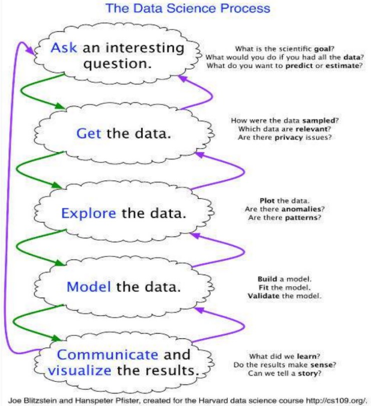

# Data Science Process
- Ask questions
- Data Collection
- Data Exploration
- Data Modeling
- Data Analysis
- Visualization and Presentation of Results

# What are data?
Multiple **measurement** of something on a **scale**.  
**Everything** is (can be) data

# Where do data come from?
- Internal sources
- Existing External Sources
- External Sources Requiring Collection Efforts
# Ways to gather online data
- API (Application Programming Interface)
- RSS (Rich Site Summary)
- Web scraping

# Data storage
- **Tabular Data**: *a dataset that is a two-dimensional table, where 
each row typically represents a single data record, and each 
column represents one type of measurement (csv, dat, xlsx, etc.).*
- **Structured Data**: each data record is presented in a form of a 
[possibly complex and multi-tiered] dictionary (json, xml, etc.)
- **Semistructured Data**: not all records are represented by the same 
set of keys or some data records are not represented using the 
key-value pair structure

# Data types
Simple or atomic types:
- Numeric
- Boolean
- Strings

Compound, composed of a bunch of atomic types:
- Date and time
- Lists
- Dictionaries

# Data format
- Textual Data
- Temporal Data
- Geolocation Data

# Tabular data
In tabular data, each record represents a set of measurements of a single object or event.   

Each type of measurement is called a **variable** (**attribute** or **feature**)  of the data (e.g. seq_id, status and duration are variables or attributes).  

The **number of attributes** is called the **dimension**.  

Each table contains a set of **Samples** (**records** or **observations**) of the **same** kind of object or event (e.g. our table above contains observations of rides/checkouts)

## Tabularize the data
Each **file** corresponds to a **dataset**  
Each **column** represents a **single variable**  
Each **row** represents a **single observation**

# Why do data types matter a lot?
It’s important to distinguish between **classes** of variables or attributes based on the **type of values** they can take on.

- **Quantitative variable**: is numerical and can be either:
  - **discrete** : a finite number of values are possible in any bounded 
  interval.   
  For example: “Number of siblings” is a discrete variable
  - **continuous** : an infinite number of values are possible in any 
  bounded interval.   
  For example: “Height” is a continuous variable
- **Categorical variable**: no inherent order among the values   
For example: “What kind of pet you have” is a categorical variable

# Data cleaning
Common issues with data:
- Missing values
- Messy data format
- Not usable

## Missing data
- Missing Completely at Random (MCAR).
- Missing at Random (MAR).
- Not Missing at Random (NMAR).

## How Should You Handle Missing Data?
- Deletion: **List-wise deletion**
- Imputation: **Prior knowledge of an ideal number**, **Regression imputation**, **Simple Imputation**, **KNN Imputation**

### List-Wise deletion
- Remove a record or observation in the dataset if it contains some 
missing values.
- Perform list-wise deletion on any of the aforementioned missing 
value categories.
- **Disadvantages** is potential information loss.
- **General rule**: when the number of observations with missing 
values exceeds the number of observations without missing 
values.

