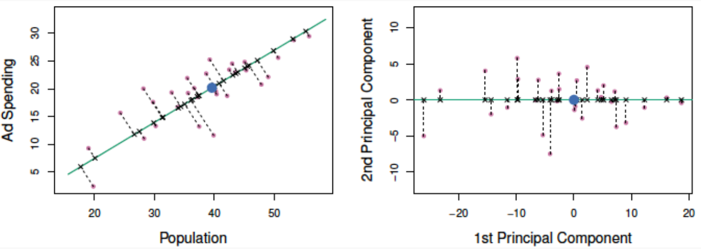
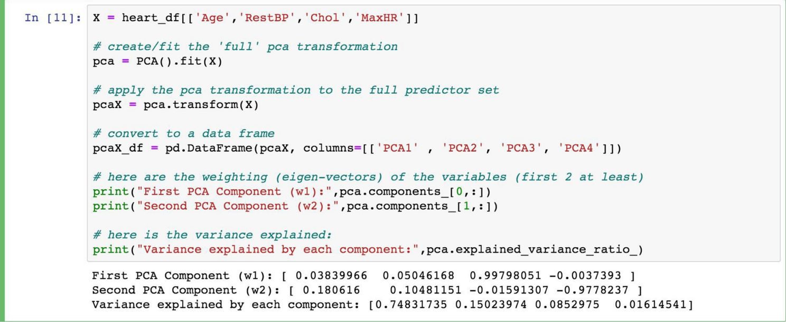

We will not be able to uniquely determine 3.mil parameters with only 100k observations. In this case, we call the model unidentifiable.

To handle this in practice, we can:
- Increase the number of observation
- Consider only scientifically important interaction terms
- Use an appropriate method that account for this issue
- Perform another dimensionality reduction technique like PCA

Interaction Terms会导致特征维度的急剧上升，因此我们需要一些手段来解决维度过大的问题

# What is ‘Big Data’?

## n is big (sample size is large)

- Algorithms can take forever to finish.
- If you are tuning a parameter or choosing between models 
(using CV), this exacerbates the problem

### solution

- Perform ‘preliminary’ steps (model selection, tuning, etc.) on a subset of the training data set. 10% or less can be justified
- If the data are not representative of the population, then modeling results can be terrible. **Random sampling** ensures representative data

## p is big (the number of predictors is large)

### **High Dimensionality**

the number of parameters exceeds or is close to the number of observations.

- Matrices may not be invertible (issue in OLS).
- Multicollinearity is likely to be present
- Models are susceptible to overfitting

# How to handle with high dimensionality?

create a new, smaller set of predictors by taking linear combinations of the original predictors.
We choose $Z_1$,$Z_2$ ,…,$Z_m$, where and where each $Z_i$ is a linear combination of the original p predictor  

$$Z_i=\sum_{j=1}^{p}\phi_{ij}X_j$$

也就是说选取m个新的predictors（即 $Z_i$ ）且m < p, 每个predictor都是原本的所有predictor（ $X_j$ )的线性组合, 以达到降维的效果

# 主成分分析（PCA，Principle Components Analysis)  

*Principal Components Analysis (PCA)* is a method to identify a new set of predictors, as linear combinations of the original ones, that captures the "maximum amount" of ***variance*** in the observed data

一种降维方法，通常用于通过将数量很多的变量转换为仍包含集合中大部分信息的较少变量来降低数据集的维数

## 主成分是什么？

Principal ComponentsAnalysis (PCA) produces a list of p principal components $Z_1$ ,…, $Z_p$ such that
- Each $Z_i$ is a linear combination of the original predictors, and it's vector norm is 1
- The $Z_i$ 's are pairwise orthogonal
- The $Z_i$ 's are ordered in decreasing order in the amount of 
captured observed variance.

That is, the observed data shows more variance in the direction of $Z_1$ than in the direction of $Z_2$ .
Toperform dimensionality reduction we select the top m principle components of PCA as our new predictors and express our observed data in terms of these predictors

主成分是初始变量的线性组合，对我们来说不存在实际意义。从几何学上讲，主成分表示解释最大方差量的数据的方向。这些组合以新变量（即主成分）不相关的方式完成，并且初始变量内的大部分信息被压缩或压缩到第一组分中。比如，10维数据提供10个主要组件，但PCA尝试在第一个组件中获取最大可能信息，然后在第二个组件中获得最大剩余信息，依此类推。

## The Intuition Behind PCA

Transforming our observed data means projecting our dataset 
onto the space defined by the top m PCA components, these 
components are our new predictors.

比如说我们有一个二维的(x, y)特征（如图所示），想降到一维

那么就是构造一条直线，然后将二维坐标系里所有的点投射（projection）到这条直线上，这样二维的坐标点就变成一维的数轴上的点

但是在投影的时候我们要保证二维的信息要尽可能少的丢失，如果投影的时候，两个不同的点在一维直线的投影位置相同，那么我们认为这样就叫做特征信息的丢失。

还是以二维举例，为了方便计算，我们把坐标原点定为x和y所有变量的平均值，即( $\overline{x}$ , $\overline{y}$ ). 然后我们旋转过该原点的直线。 
基于前面PCA最大可分思想，我们要找的方向是降维后损失最小，可以理解为投影后的数据尽可能的分开，那么这种分散程度可以用数学上的方差来表示，方差越大数据越分散。

由此拓展到更高维度，在降维的时候，我们选择一个超平面来表达正交属性空间中的样本，这个超平面需要具有以下性质：  
- 最近重构性：样本点到这个超平面的距离足够近
- 最大可分性：样本点在这个超平面上的投影能尽可能的分开

那么拓展到更高维的降维过程中（如三维降到二维），另一维如何选取呢？继续选择方差最大么？  
从二维降到一维可以使用方差最大来选出能使基变换后数据分散最大的方向（基），但如果遇到高维的变换，当完成第一个方向（基）选择后，第二个投影方向应该与第一个“几乎重合在一起”，这显然是没有用的，因此要有其它的约束条件。我们希望两个字段尽可能表示更多的信息，使其不存在相关性。
因此在高维度的降维时，我们需要使用 **协方差矩阵**。

(Math部分跳过，毕竟调用库的函数就几行... 感兴趣的自己网上搜吧)

(课上的example跳过，自己看吧，有助于加深理解...敲公式太麻烦了)

代码量真的很少

## 协方差
（帮助理解用的，计算方法见网上，该定义来自百度百科）  
从直观上来看，协方差表示的是两个变量总体误差的期望。  
如果两个变量的变化趋势一致，也就是说如果其中一个大于自身的期望值时另外一个也大于自身的期望值，那么两个变量之间的协方差就是正值；如果两个变量的变化趋势相反，即其中一个变量大于自身的期望值时另外一个却小于自身的期望值，那么两个变量之间的协方差就是负值。  
如果X与Y是统计独立的，那么二者之间的协方差就是0，因为两个独立的随机变量满足E[XY]=E[X]E[Y]。   
但是，反过来并不成立。即如果X与Y的协方差为0，二者并不一定是统计独立的。  
协方差Cov(X,Y)的度量单位是X的协方差乘以Y的协方差。  
协方差为0的两个随机变量称为是不相关的。 

一句话概括，确定了第一主成分的情况下，第二主成分尽量满足与第一主成分的协方差为0

# PCA for Regression (PCR)
If we use all p of the new $Z_j$, then we have not improved the dimensionality. Instead, we select the first M PCA variables, $Z_1$,...,$Z_M$, to use as predictors in a regression model.

**Cross Validation** —— the best way to check for a specified problem

- PCA is an **unsupervised** algorithm. It is done independent of the outcome variable.
    - Note: the component vectors as predictors might not be ordered from best to worst!

- PCA is not so good because:
    1. Direct Interpretation of coefficients in PCRis completely lost. So do not 
    do if interpretation is important.
    2. Will often not improve predictive ability of a model.  

- PCA is great for:
    1. Reducing dimensionality in high dimensional settings.
    2. Visualizing how predictive your features can be of your response, 
    especially in the classification setting.
    3. Reducing multicollinearity, and thus may improve the computational
    time of fitting models

# PCA for Imputation
we want our imputations to take into account：

1. links between variables  
2. global similarity between individual 
observations.   

This is the idea behind the iterative PCA algorithm for imputation.

## Iterative PCA- Algorithm

1. Initialize imputation with reasonable value (e.g., mean)
2. Iterate until convergence:
    1. perform PCAon the complete data
    2. retain first M components of PCA(in example M=1)
    3. project imputation into PCA space
    4. update imputation using projection value

（这部分真没懂...)

Reference：  
[PCA主成分分析学习总结 - 鱼遇雨欲语与余的文章 - 知乎](https://zhuanlan.zhihu.com/p/32412043)  
[如何通俗易懂地讲解什么是 PCA（主成分分析）？ - 马同学的回答 - 知乎](https://www.zhihu.com/question/41120789/answer/481966094)  
[主成分分析(PCA)的详细解释 - 知足常乐的文章 - 知乎](https://zhuanlan.zhihu.com/p/58663947)
