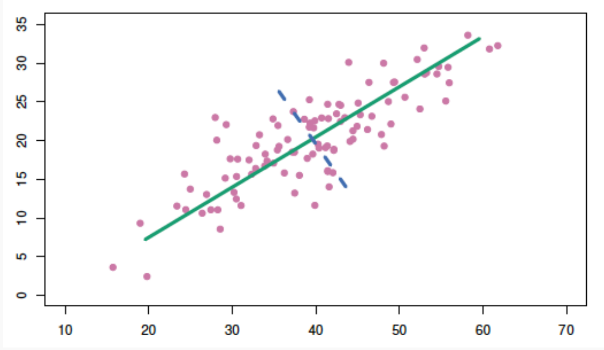

这节课讲的东西全是术语...一个概念衍生出另一个概念，该细讲的地方全是一笔带过，真的是一言难尽。。。  

搞明白主成分分析首先要弄懂几个术语，包括协方差，相关系数等等  

# 主成分分析（PCA，Principle Components Analysis)  

Principal Components Analysis (PCA) is a method to identify a 
new set of predictors, as linear combinations of the original 
ones, that captures the `maximum amount' of ***variance*** in the observed data

一种降维方法，通常用于通过将数量很多的变量转换为仍包含集合中大部分信息的较少变量来降低数据集的维数  

## 主成分是什么？

主成分是新变量，是初始变量的线性组合，对我们来说不存在实际意义。从几何学上讲，主成分表示解释最大方差量的数据的方向。这些组合以新变量（即主成分）不相关的方式完成，并且初始变量内的大部分信息被压缩或压缩到第一组分中。比如，10维数据提供10个主要组件，但PCA尝试在第一个组件中获取最大可能信息，然后在第二个组件中获得最大剩余信息，依此类推。

create a new, smaller set of predictors by taking linear combinations of the original predictors.
We choose $Z_1$,$Z_2$ ,…,$Z_m$, where and where each $Z_i$ is a linear combination of the original p predictor  

$$Z_i=\sum_{j=1}^{p}\phi_{ij}X_j$$

也就是说选取m个新的predictors（即$Z_i$）且m < p, 每个predictor都是原本的所有predictor（$X_j$)的线性表示

比如说我们有一个二维的(x,y)特征（如图所示），想降到一维

那么就是构造一条直线，然后将二维坐标系里所有的点投射（projection）到这条直线上，这样二维的坐标点就变成一维的数轴上的点

但是在投影的时候我们要保证二维的信息要尽可能少的丢失，如果投影的时候，两个不同的点在一维直线的投影位置相同，那么我们认为这样就叫做特征信息的丢失。

由此拓展到更高维度，在降维的时候，我们选择一个超平面来表达正交属性空间中的样本，这个超平面需要具有以下性质：

    最近重构性：样本点到这个超平面的距离足够近
    最大可分性：样本点在这个超平面上的投影能尽可能的分开

还是以二维举例，为了方便计算，我们把坐标原点定为x和y所有变量的平均值，即($\overline{x}$, $\overline{y}$). 然后我们旋转过该原点的直线。

基于前面PCA最大可分思想，我们要找的方向是降维后损失最小，可以理解为投影后的数据尽可能的分开，那么这种分散程度可以用数学上的方差来表示，方差越大数据越分散。

那么拓展到更高维的降维过程中（如三维降到二维），另一维如何选取呢？继续选择方差最大么？

从二维降到一维可以使用方差最大来选出能使基变换后数据分散最大的方向（基），但如果遇到高维的变换，当完成第一个方向（基）选择后，第二个投影方向应该与第一个“几乎重合在一起”，这显然是没有用的，因此要有其它的约束条件。我们希望两个字段尽可能表示更多的信息，使其不存在相关性。。

## 协方差

这里就涉及到协方差的概念，因为

 PCA算法的主要优点有：

    仅仅需要以方差衡量信息量，不受数据集以外的因素影响。　各主成分之间正交，可消除原始数据成分间的相互影响的因素。计算方法简单，主要运算是特征值分解，易于实现。

PCA算法的主要缺点有：

    主成分各个特征维度的含义具有一定的模糊性，不如原始样本特征的解释性强。方差小的非主成分也可能含有对样本差异的重要信息，因降维丢弃可能对后续数据处理有影响。
Reference：

[PCA主成分分析学习总结 - 鱼遇雨欲语与余的文章 - 知乎](https://zhuanlan.zhihu.com/p/32412043)  

[如何通俗易懂地讲解什么是 PCA（主成分分析）？ - 马同学的回答 - 知乎](https://www.zhihu.com/question/41120789/answer/481966094)

[主成分分析(PCA)的详细解释 - 知足常乐的文章 - 知乎](https://zhuanlan.zhihu.com/p/58663947)
