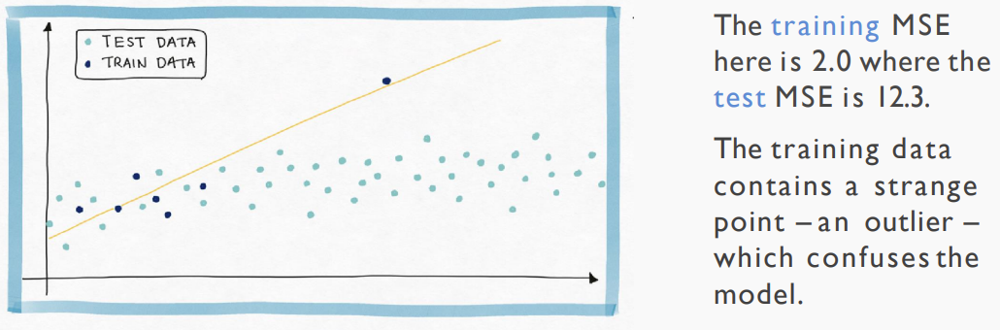
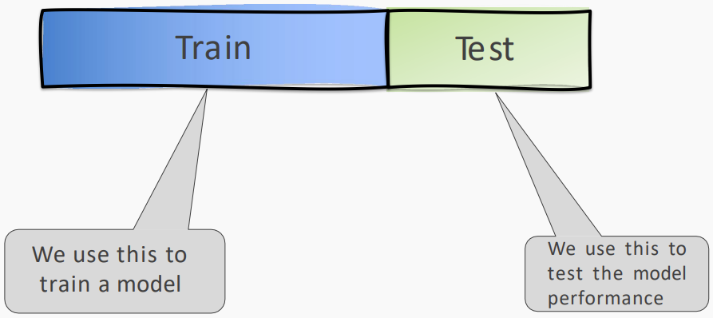
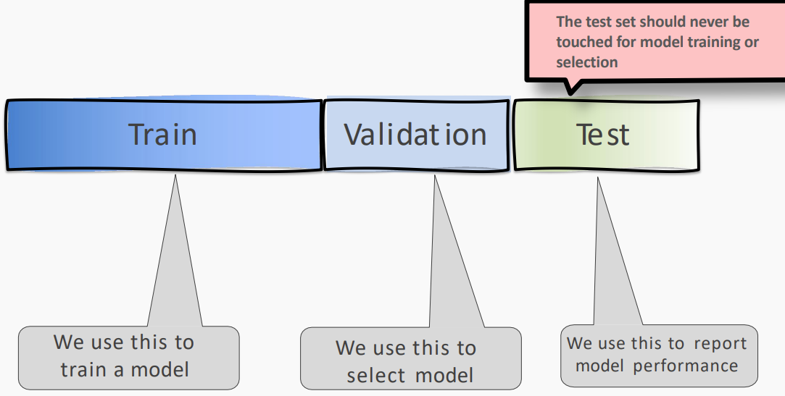
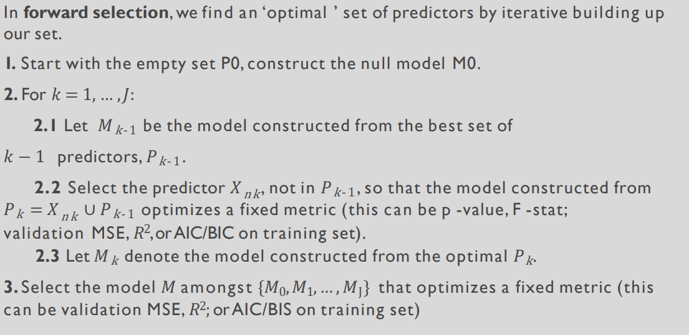

# Evaluation: Training Error & Test Error
evaluate the fitted model by **test data**

Fitting to meaningless patterns in the training is called **overfitting**

## Overfitting: Another Motivation for Model Selection
To avoid overfitting, use smaller set of significant predictors

**Definition**: Overfitting is the phenomenon where the model is **unnecessarily complex**, in the sense that portions of the model **captures the random noise** in the observation, rather than the **relationship between predictor(s) and response.**

Overfitting causes the model to lose predictive power on 
new data

## Generalization Error

overfitting means models do well on training test but poorly on test data (new data)

The ability of models to do well on new data is called 
**generalization**.

The **goal** of **model selection** is to choose the model that 
generalizes the best

# Model Selection
The application of a principled method to **determine the complexity of the model**, e.g., choosing a subset of predictors, choosing the degree of the polynomial model etc

- avoid overfitting

overfitting happens when:
- there are too many predictors:
  - the feature space has high dimensionality
  - the polynomial degree is too high
  - too many cross terms are considered

- the coefficients values are too extreme

Model selection steps:
1. split the training set into two subsets: **training** and **validation**
2. **multiple** models (e.g. polynomial models with different degrees) are fitted on the training set; each model is evaluated on the validation set
3. the model with the **best validation performance** is selected
4. the selected model is evaluated one last time on the testing set

Ways of modelselection:
- Exhaustive search
- Greedy algorithms
- Fine tuning hyper-parameters
- Regularization

## Exhaustive search
if we have $J$ predictors,try $2^J$ models

Complexity: $O(2^j)$
## Greedy algorithms
Selecting **optimal subsets** of predictors (including choosing the 
**degree of polynomial models**) through:
- stepwise variable selection - **iteratively** building an optimal subset of predictors by optimizing a fixed model valuation metric each time.
- selecting an optimal model by evaluating each model on validation set.

Complexity: $O(j^2)$

## Fine tuning hyper-parameters
turn model selection into choosing a **hyper-parameter**

# Model Selection with Cross Validation
## Motivation
Using a single validation set to select amongst multiple models can be problematic - there is the possibility of **overfitting to the validation set**.

One solution is to evaluate each model on multiple validation sets and average the validation performance.

One can randomly split the training set into training and validation multiple times 
- but randomly creating these sets can
create the scenario where important features of the data never appear in our random draws.

## K-Fold Cross Validation

# KNN Revisited
A principled way to choose k is through K-fold cross 
validation.

## how to choose number of folds?
A higher k (number of folds) lead to a lower prediction error.

A lower k means expect a higher prediction error on average

## Careful Considerations
- Time-series dataset
  - We can still use cross-validation for time-series datasets using some other technique such as **time-based folds**.
- Unbalanced dataset
  - One way to consider is the use of **stratified sampling** instead of splitting randomly. [参考资料](https://www.marcoaltini.com/blog/dealing-with-imbalanced-data-undersampling-oversampling-and-proper-cross-validation)
- Nested cross-validation
  - The nested keyword comes to hint at the use of double cross-validation on each fold. The hyper-parameter tuning validation is achieved using another k-fold splits on the folds used to train the model.
- Overfitting
  - We rely on using a validation dataset for early stopping and parameter tuning different from the testing set during the building of models